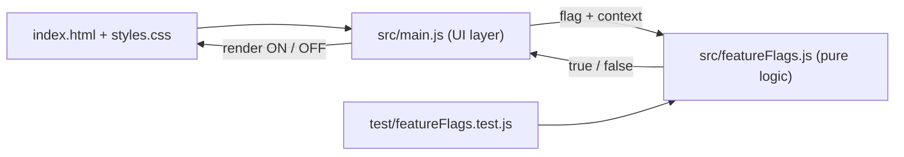

# Feature Flag Demo (FeatureOps PoC + CI/CD practice)

A tiny **visual web app** that shows, in real time, whether a feature flag is
**ON or OFF** for a given user — including a **gradual rollout** with consistent
hashing, just like an Unleash-style SDK evaluates flags locally.

It doubles as a **playground to learn CI/CD** (lint, test, build, release).

## Run it (see it immediately)

It's plain HTML/CSS/JS — serve the folder with any static server:

```bash
# option A: no install needed
python3 -m http.server 8000
# then open http://localhost:8000

# option B: with esbuild dev server (after npm install)
npm run dev
```

Open the page, change the flag config on the left, and watch the feature flip.

## Scripts (the building blocks of a CI pipeline)

```bash
npm install      # install dev dependencies (eslint, esbuild)
npm run lint     # static analysis
npm test         # unit tests (Node's built-in test runner)
npm run build    # bundle + minify into dist/bundle.js (a release artifact)
```

## Project layout

```
src/featureFlags.js   # pure, testable flag-evaluation logic
src/main.js           # DOM/UI wiring
test/featureFlags.test.js
index.html, styles.css
eslint.config.js, package.json
```

## How it works (architecture)

**Stack:** plain **JavaScript (ES modules)** + **HTML** + **CSS**. No framework.
Tests run on **Node's built-in test runner**, build/bundle with **esbuild**,
static analysis with **ESLint**.

The key design choice is the **separation between flag logic and UI**:

- `src/featureFlags.js` — **pure logic** (no DOM). Given a `flag` and a
  `context`, it returns `true/false`. Because it's pure, it's trivial to unit
  test and could run anywhere (browser, Node, a server) — exactly how a real
  feature-flag SDK keeps evaluation independent from the UI.
- `src/main.js` — **UI layer**. Reads the controls from the DOM, builds the
  `flag` + `context`, calls `isEnabled()`, and paints the ON/OFF result.
- `index.html` + `styles.css` — structure and styling.
- `test/featureFlags.test.js` — tests target the pure logic only.

Data flow:



Why it matters: this mirrors how an SDK (like Unleash's) **separates flag
evaluation from rendering** — which is what makes the logic fast, portable, and
testable, and what lets a CI pipeline validate it with simple unit tests.

## Feature-flag concepts shown here

- **on**: enabled for everyone.
- **gradualRollout**: enabled for a % of users, consistently (same user → same result).
- **userIds**: targeting specific users.

These mirror Unleash **activation strategies**.
