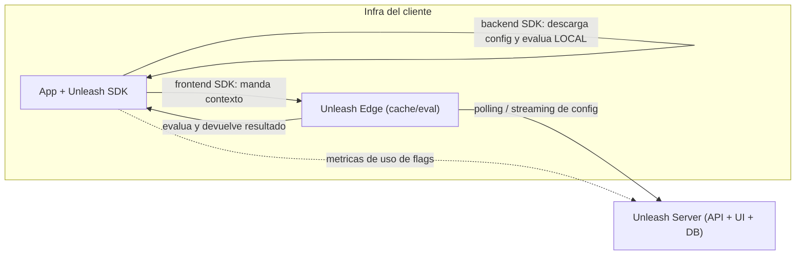

# 04 — Unleash a fondo

> Objetivo: saber qué es Unleash, **qué vende y cómo lo vende**, su
> **arquitectura**, cómo se **integra**, y el **flujo exacto** de valor para devs
> y management. Esto es el núcleo para un Solutions Engineer de Unleash.

## 4.1 Qué es Unleash

Unleash (razón social **Bricks Software AS**, Oslo, Noruega) es una **plataforma
open source de feature management** (FeatureOps). Permite a los equipos:
- gestionar **feature flags**,
- hacer **gradual rollouts / canary**,
- **targeting** y segmentación,
- **A/B testing / experimentación**,
- **kill switches**,
- con **gobernanza** enterprise (RBAC, audit logs, change requests, SSO).

Datos clave (para contexto comercial):
- **Open source** con muchísima tracción (≈13k+ estrellas en GitHub, 40M+
  descargas).
- **Serie B de $35M (marzo 2026)**, liderada por One Peak; total levantado ≈
  $51,5M.
- Clientes enterprise: **Lloyds Banking Group, Prudential, Wayfair, Lenovo,
  Mercadona, Visa, Samsung** (y citan Blue Origin, Docker, etc.).
- Reconocida por el **ThoughtWorks Technology Radar**; bien valorada en G2.
- Mantra/posicionamiento: *"create with freedom, release with confidence"* y el
  ángulo IA: *"friends don't let friends ship AI-generated code without feature
  flags"*.

## 4.2 Qué venden exactamente (producto y planes)

Unleash tiene un **modelo open-core**: un núcleo open source gratuito + ediciones
de pago con funcionalidades enterprise.

- **Open Source (gratis, self-hosted con Docker):** el servidor Unleash, las
  feature flags, las **activation strategies** (gradual rollout, userIds, etc.),
  los SDKs, la API. Suficiente para usar feature flags "de verdad".
- **Pro / Pay-as-you-go (cloud):** SaaS gestionado por Unleash, con extras.
- **Enterprise:** lo que compran las grandes cuentas. Aquí está el dinero y el
  trabajo de un SE. Añade **gobernanza y escala**:
  - **SSO** (SAML/OIDC), **RBAC** (control de acceso por roles), **SCIM**.
  - **Change requests / approvals** (flujo de aprobación de cambios en prod).
  - **Audit logs** avanzados.
  - **Unleash Edge** (escala y baja latencia, ver 4.4), streaming en tiempo real.
  - **SOC 2 Type II**, data residency, despliegue self-hosted/híbrido.
  - Soporte, SLAs, etc.

> Mensaje de venta clave: **las flags básicas son gratis (OSS); lo que se paga es
> la gobernanza, la escala y el control enterprise.** Un cliente regulado (banca,
> seguros, salud, gov) paga por SSO/RBAC/audit/self-hosting, no por el `if`.

## 4.3 Cómo lo venden (motion comercial y rol del SE)

- **Bottom-up + enterprise:** muchos devs ya **conocen/usan el OSS** → entra por
  abajo (developer-led) y luego se **expande a un contrato enterprise** cuando la
  organización necesita gobernanza/escala ("land & expand").
- **Open source como motor de confianza:** el código es público → credibilidad
  técnica, sin lock-in, fácil de probar. Es un argumento de venta enorme frente a
  SaaS cerrados.
- **Diferenciador estrella en EU:** **self-hosting + soberanía del dato
  (GDPR/Schrems II)**. Para banca/seguros/salud que **no pueden** enviar datos a
  un SaaS US, Unleash es la opción natural.
- **El SE (tu rol):** es el **núcleo técnico del GTM**, embebido con el AE en
  todas las reuniones de cliente. Lidera **discovery**, **demos a medida**,
  **PoCs** (a menudo en la infra del cliente), arquitectura de despliegue
  (SaaS/hybrid/self-hosted), **security reviews** y es **technical lead de los
  RFP**. Convierte la evaluación técnica en el **technical win**.

## 4.4 Arquitectura (lo más importante para impresionar)

El diseño de Unleash prioriza **privacidad, velocidad y resiliencia** mediante
**evaluación local**:

- **Unleash Server (API + UI):** donde defines flags, estrategias, entornos,
  proyectos. Tiene la Admin API (gestión), la Client API (para SDKs backend) y la
  Frontend API.
- **SDKs:** se integran en la app del cliente. Hay **25+** (server-side y
  client-side). Dos familias:
  - **Backend SDKs (server-side):** descargan **toda la configuración** de flags
    y **evalúan localmente, en memoria** (latencia ~0, < 1 ms). La **PII del
    usuario nunca sale** de la infra del cliente. → argumento privacy/GDPR.
  - **Frontend SDKs (client-side, navegador/móvil):** **no** evalúan localmente;
    mandan el **contexto** a **Unleash Edge** (o al server), que evalúa y devuelve
    **solo el resultado** (qué flags están on para ese contexto).
- **Unleash Edge:** capa ligera de **caché y evaluación** que se despliega cerca
  del cliente (incluso en CDN). Aguanta **miles de SDKs** sin sobrecargar el
  server central, y **sigue sirviendo la última config aunque el server caiga**
  (resiliencia). Es el sucesor del antiguo *Unleash Proxy*. En Enterprise soporta
  **streaming** (actualizaciones en tiempo real) además de **polling**.
- **Sincronización:** los SDKs/Edge **no** consultan el server en cada
  evaluación; **se descargan la config periódicamente** (polling cada pocos
  segundos) o por streaming. Por eso la evaluación es instantánea y resiliente.
- **Bootstrapping:** muchos backend SDKs pueden arrancar desde un fichero/entorno
  sin red (útil para arranques en frío o entornos sin conexión).
- **Deployment:** **Cloud**, **self-hosted** (Docker) o **híbrido**. **SOC 2
  Type II**.

> Frase de oro para entrevista (latencia/privacidad): *"Backend SDKs evaluate
> locally in-memory, so there's no HTTP call per flag check — latency is
> effectively zero and the user's PII never leaves their infrastructure. The SDK
> just syncs the ruleset in the background."*

## 4.5 Conceptos del producto Unleash (jerga propia)

- **Project:** agrupa flags (por equipo/producto).
- **Environment:** dev/staging/prod; cada flag tiene estado/estrategias por
  entorno.
- **Feature toggle:** la flag.
- **Activation strategy:** la regla (gradualRollout/flexibleRollout, userWithId,
  etc.).
- **Constraints:** condiciones extra (country, plan, etc.).
- **Segments:** grupos reutilizables de constraints.
- **Variants:** para A/B/n testing (valores/payloads, no solo on/off).
- **Unleash Context:** datos del request (userId, sessionId, properties...).
- **Stickiness:** campo para consistencia del rollout.
- **API tokens:** distintos tipos — **client** (backend SDK), **frontend**
  (frontend SDK), **admin** (gestión). Importante para integrar.
- **Change requests, RBAC, SSO, audit log:** gobernanza (Enterprise).
- **Impression data / metrics:** datos de uso/exposición de flags para medir.

## 4.6 Integraciones del ecosistema

Unleash integra con **Slack, Microsoft Teams, Jira, Datadog, Terraform**, y
herramientas de IA (**GitHub Copilot, Claude Code**). Soporta **OpenFeature** (el
estándar CNCF para feature flags), lo que evita lock-in.

## 4.7 El flujo EXACTO de valor (devs vs management)

**Para el desarrollador:**
1. Envuelve el código nuevo en una flag (`if (unleash.isEnabled('x', ctx))`).
2. Mergea a `main` y despliega aunque la feature esté **apagada** (TBD).
3. El SDK evalúa en local con la config que sincroniza del server/Edge.
4. Activa la flag para sí mismo / un entorno de test sin tocar código.
5. Cuando hay un bug, **apaga la flag** (kill switch) sin desplegar.
6. Cuando la feature está estable al 100%, **retira la flag** del código.

**Para producto/management:**
1. Desde la **UI de Unleash** (sin tocar código) controla el **rollout**: 1% →
   10% → 50% → 100%, o por **segmento** (país, plan, beta...).
2. Lanza **experimentos A/B** y mide variantes.
3. Ve el **audit log**: quién encendió/apagó qué y cuándo (clave en regulados).
4. Usa **change requests/approvals** para cambios en producción (gobernanza).
5. Coordina lanzamientos con campañas de negocio **sin depender de un deploy**.

**Resultado:** ingeniería **despliega continuo y sin miedo**; negocio **controla
el lanzamiento**; ambos comparten **un mismo sistema con control, medición y
reversibilidad**. Eso es FeatureOps.

## 4.8 Competencia y posicionamiento

- **LaunchDarkly:** el líder comercial (SaaS cerrado). Mayor matriz de SDKs y
  experimentación integrada. Caro y **sin self-host real**. Unleash gana cuando
  importan **open source, self-hosting y soberanía del dato**.
- **Statsig:** fuerte en **experimentación/estadística** (equipo ex-Facebook).
- **Split / Optimizely:** experimentación / A-B.
- **Flagsmith, GrowthBook, PostHog, ConfigCat:** otras alternativas (algunas
  OSS). GrowthBook = warehouse-native para A/B; PostHog = suite con analytics.
- **Posición de Unleash:** **el OSS más enterprise-mature**; el mejor encaje para
  **entornos regulados europeos** que exigen self-hosting y GDPR.

## 4.9 Cómo se conecta con NUESTRA app

Nuestra `feature-flag-demo` **imita** a Unleash (estrategias, hashing,
contexto), pero **no está conectada** a un Unleash real. En el capítulo 5
levantamos un **Unleash real con Docker** y enchufamos el SDK, para que veas el
flujo de verdad y puedas decir con honestidad *"I spun up Unleash locally and
wired the SDK"*.

---

[⬆ Índice](README.md) · [➡️ Siguiente: 08 — Integración en código (contrato cliente ↔ Unleash)](08-code-and-integration.md)
