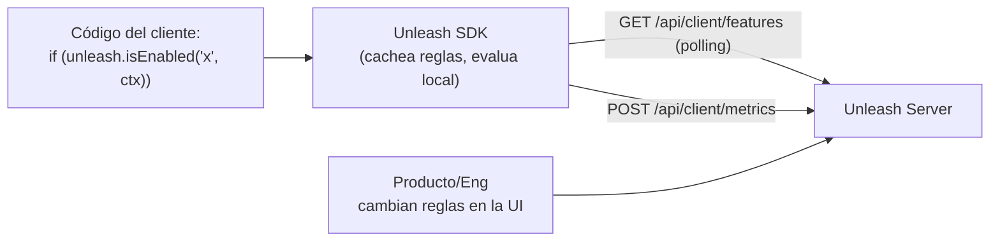

# 08 — Integración en código: el contrato cliente ↔ Unleash

> Objetivo: ver **en código** cómo el cliente integra el SDK, **qué recibe** del
> servidor Unleash (el JSON de configuración), **cómo se comunican** (polling y
> métricas) y **cómo se gestionan** las configuraciones (contexto, variants,
> entornos, tokens, offline).
>
> Nota: los formatos pueden variar entre versiones; verifica contra
> `https://docs.getunleash.io`. La estructura conceptual se mantiene.

## 8.1 La idea en una frase

El cliente escribe **muy poco**: inicializa un SDK y pregunta
`isEnabled("flag", context)`. **Todo lo demás** (las reglas, los %, el targeting)
vive en el servidor Unleash y el SDK se lo **descarga y cachea**. El cliente
**no codifica la lógica de la flag**; solo el **punto de decisión**.



## 8.2 Lo que el cliente pone en SU código (backend SDK, Node)

```js
const { initialize } = require('unleash-client');

// 1) Inicializar UNA vez al arrancar la app
const unleash = initialize({
  url: 'https://unleash.mycompany.com/api/', // server o Unleash Edge
  appName: 'checkout-service',
  customHeaders: { Authorization: process.env.UNLEASH_CLIENT_TOKEN }, // client token
  refreshInterval: 15000,  // cada cuánto re-descarga la config (ms)
  metricsInterval: 60000,  // cada cuánto envía métricas de uso (ms)
});

// 2) Esperar a que tenga la config en memoria
unleash.on('ready', () => {
  // 3) Usar la flag en el punto de decisión, con CONTEXTO del usuario
  const context = { userId: '12345', properties: { country: 'ES', plan: 'premium' } };

  if (unleash.isEnabled('new-checkout', context)) {
    renderNewCheckout();
  } else {
    renderClassicCheckout();
  }
});
```

Puntos clave:
- **`initialize` una vez**; el SDK mantiene la config en memoria y la refresca en
  segundo plano (no hay llamada HTTP por cada `isEnabled`).
- **`context`**: lo que permite el targeting/rollout (userId, country, plan...).
- **Default seguro:** si el SDK aún no está listo o no hay datos, `isEnabled`
  devuelve `false` (o el default que indiques). Nunca peta por esto.

## 8.3 Qué RECIBE el cliente de Unleash (el JSON de configuración)

El backend SDK pide periódicamente `GET /api/client/features` (con su client
token). Unleash responde con **todas las flags y sus reglas** (esto es lo que el
SDK cachea y evalúa en local):

```json
{
  "version": 2,
  "features": [
    {
      "name": "new-checkout",
      "type": "release",
      "enabled": true,
      "project": "default",
      "stale": false,
      "strategies": [
        {
          "name": "flexibleRollout",
          "parameters": {
            "rollout": "50",
            "stickiness": "userId",
            "groupId": "new-checkout"
          },
          "constraints": [
            { "contextName": "country", "operator": "IN", "values": ["ES", "PT"] },
            { "contextName": "plan", "operator": "IN", "values": ["premium"] }
          ]
        }
      ],
      "variants": [
        { "name": "blue",  "weight": 500, "payload": { "type": "string", "value": "#0000ff" } },
        { "name": "green", "weight": 500, "payload": { "type": "string", "value": "#00ff00" } }
      ]
    }
  ]
}
```

Cómo leer esto (clave para un SE):
- **`enabled`**: interruptor global de la flag.
- **`strategies`**: lista de estrategias; basta que **una** se cumpla para activar.
  - `name`: la estrategia (`flexibleRollout`, `userWithId`, `default`...).
  - `parameters`: sus ajustes (`rollout` %, `stickiness`, `groupId`).
  - `constraints`: condiciones extra sobre el **contexto** (country IN [ES,PT],
    plan IN [premium]...). Operadores: `IN`, `NOT_IN`, `STR_CONTAINS`,
    `NUM_GT`, `DATE_AFTER`, `SEMVER_GT`, etc.
- **`variants`**: para A/B/n; cada una con un **peso** y un **payload**.

El SDK toma este JSON + el `context` del request y **calcula localmente** el
`true/false` (y la variante). El servidor **no** evalúa por cada usuario en
backend; solo entrega las reglas.

## 8.4 Cómo se comunican (el ciclo de sincronización)

1. **Arranque:** el SDK hace `GET /api/client/features` y guarda la config en
   memoria.
2. **Polling:** cada `refreshInterval` (p. ej. 15s) vuelve a pedirla → así los
   cambios que haces en la UI de Unleash llegan a la app en segundos, **sin
   redeploy**. (Unleash Edge puede usar **streaming** para que sea casi
   instantáneo.)
3. **Evaluación:** cada `isEnabled()` se resuelve **en memoria** (sin red) →
   latencia ~0.
4. **Métricas:** cada `metricsInterval` el SDK hace `POST /api/client/metrics`
   con cuántas veces cada flag salió `yes/no`:

```json
{
  "appName": "checkout-service",
  "instanceId": "checkout-7c9f-1",
  "bucket": {
    "start": "2026-06-28T10:00:00Z",
    "stop": "2026-06-28T10:01:00Z",
    "toggles": {
      "new-checkout": { "yes": 1342, "no": 1190, "variants": { "blue": 700, "green": 642 } }
    }
  }
}
```

> Esto es lo que alimenta la **observability** de FeatureOps: exposiciones por
> flag/variante, para medir adopción e impacto. (Y es justo el paralelismo con
> NPAW: el SDK, además de su función, **envía telemetría de uso** de vuelta.)

## 8.5 Frontend SDK (navegador/móvil): contrato distinto

En cliente NO se descargan todas las reglas (ni el token de cliente, por
seguridad). El frontend SDK manda el **contexto** y recibe **solo las flags ya
evaluadas** para ese contexto, vía **Unleash Edge** o `/api/frontend`:

```js
import { UnleashClient } from 'unleash-proxy-client';

const unleash = new UnleashClient({
  url: 'https://edge.mycompany.com/api/frontend', // Edge o Frontend API
  clientKey: 'FRONTEND_TOKEN',                     // frontend token (no client token)
  appName: 'webapp',
  context: { userId: 'victor' },
});

unleash.on('ready', () => {
  if (unleash.isEnabled('new-checkout')) showNewCheckout();
  const variant = unleash.getVariant('new-checkout'); // A/B
  if (variant.name === 'blue') applyBlueTheme();
});
unleash.start();
```

Respuesta de `/api/frontend` (flags **ya resueltas**, sin reglas ni PII de más):

```json
{
  "toggles": [
    {
      "name": "new-checkout",
      "enabled": true,
      "variant": { "name": "blue", "enabled": true, "payload": { "type": "string", "value": "#0000ff" } }
    }
  ]
}
```

> Por qué importa (privacidad): la **evaluación ocurre en Edge**, dentro de la
> infra del cliente, así la **PII del contexto no viaja** a Unleash Cloud. Es el
> argumento GDPR/data-residency en código.

## 8.6 Gestión de configuración (lo que controla el comportamiento)

- **Tokens (qué token para qué):**
  - **client token** → backend SDKs (`/api/client/*`).
  - **frontend token** → frontend SDKs (`/api/frontend`).
  - **admin token** → gestionar Unleash por API (CI/CD, Terraform).
- **Environments:** el mismo flag tiene estado/estrategias por entorno
  (development, production...). El token está **ligado a un entorno**, así que el
  SDK recibe la config **de su entorno**.
- **Variants (A/B):** `getVariant()` devuelve la variante + payload; los `weight`
  reparten el tráfico.
- **Bootstrapping / offline:** puedes arrancar el SDK desde un JSON local/fichero
  (mismo formato que `/api/client/features`) para entornos sin red o arranques en
  frío. Útil también para tests.
- **Default values / fallback:** define qué pasa si la flag no existe o no hay
  conexión (normalmente `false`). Resiliencia: si el server cae, el SDK sigue con
  la última config cacheada.
- **Gestión por código (GitOps):** con la Admin API o el provider de **Terraform**
  puedes definir flags/estrategias **como código** y aplicarlas desde tu pipeline
  de CI/CD (en vez de a mano en la UI).

## 8.7 Mapeo con NUESTRA app (de la simulación al SDK real)

Nuestra `feature-flag-demo` **imita este contrato**:
- `src/featureFlags.js` (`isEnabled`, estrategias, hashing) = lo que hace el SDK
  **en local** con el JSON de `strategies`.
- El objeto `flag` de nuestra app (`{ enabled, strategy, percentage, userIds }`)
  es una versión simplificada del bloque `features[].strategies[]` de Unleash.
- El `context` (`{ userId }`) es el mismo concepto que el **Unleash Context**.

Para pasarlo a **real**, en `main.js` sustituirías la llamada a nuestro
`isEnabled(flag, ctx)` por `unleash.isEnabled('new-checkout', ctx)` del SDK, y las
4 pantallas reaccionarían a lo que cambies en la **UI de Unleash** (ver cap. 5).

Mini-diff conceptual:

```js
// AHORA (simulado):
import { isEnabled } from './featureFlags.js';
const on = isEnabled(currentFlag(), { userId });

// CON UNLEASH REAL (frontend SDK):
const on = unleash.isEnabled('new-checkout', { userId }); // reglas vienen del server
```

## 8.8 Resumen para explicarlo en una frase

> "The client only writes the decision point — `isEnabled(flag, context)`. The
> SDK pulls the ruleset from Unleash (`/api/client/features`) on an interval,
> caches it, and evaluates locally with the request context, so checks are
> in-memory and PII stays put. It reports usage back via `/api/client/metrics`.
> Frontend SDKs instead get pre-evaluated toggles from Edge. All the targeting,
> rollouts and variants are configured server-side and reach the app in seconds —
> no redeploy."

---

[⬆ Índice](README.md) · [➡️ Siguiente: 05 — De la teoría a la práctica](05-hands-on-with-this-app.md)
